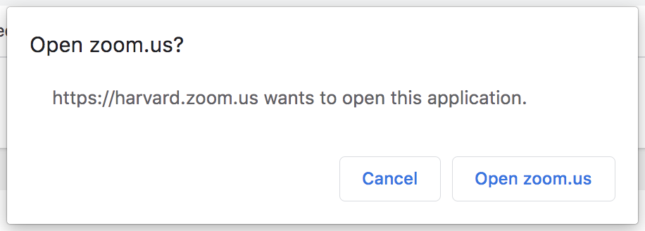
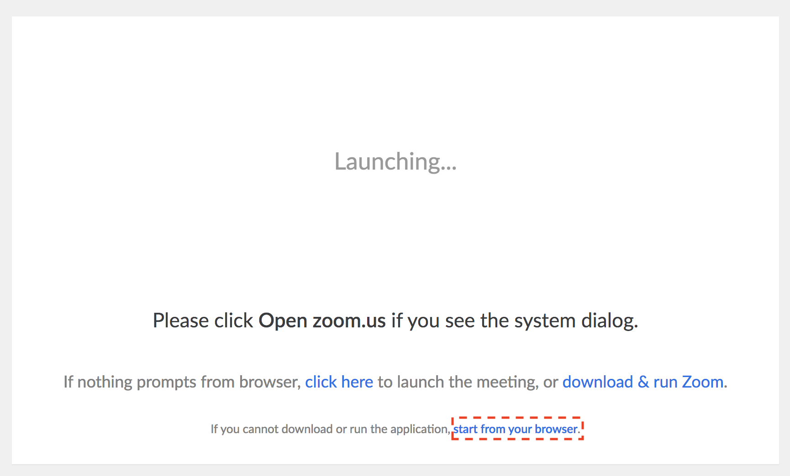
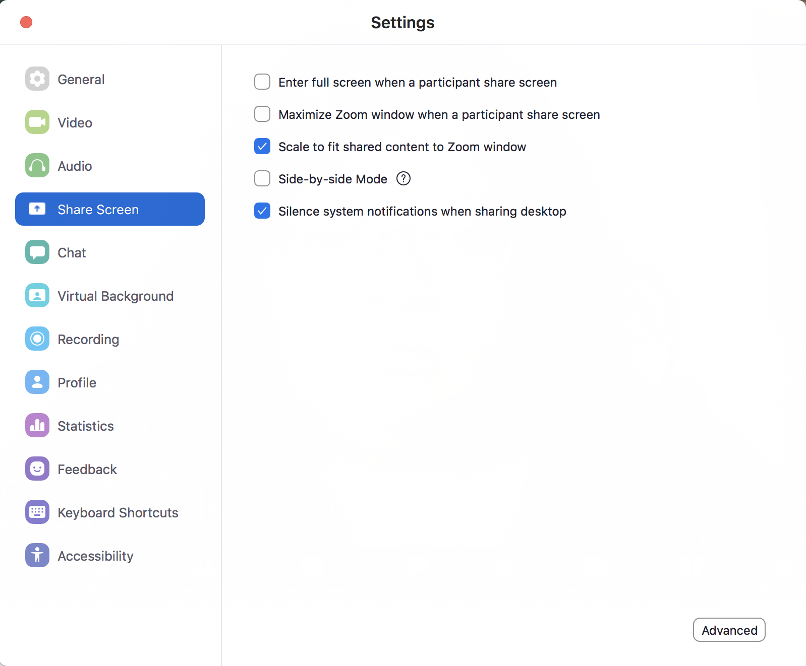
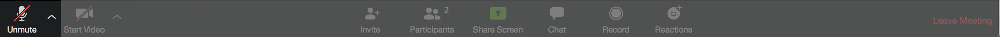
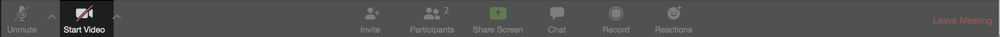
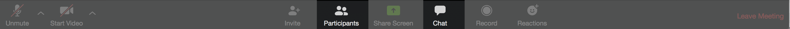
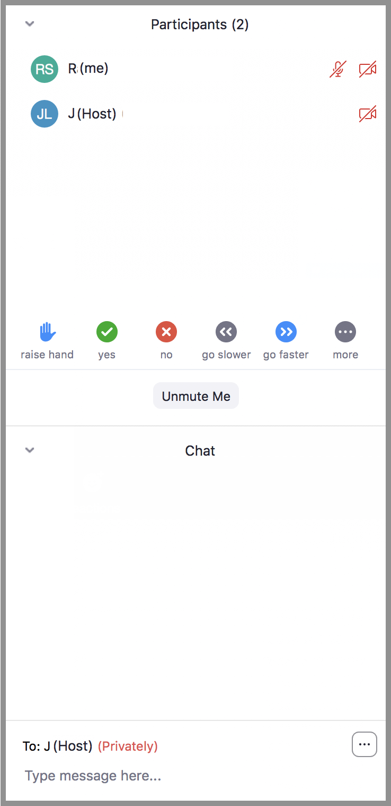
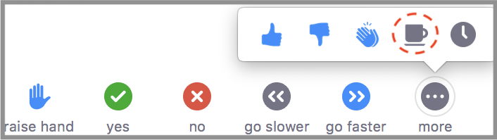

# Guidelines for learners

These guidelines are for learners taking a hands-on workshop online with the [Harvard Chan Bioinformatics Core](https://bioinformatics.sph.harvard.edu)

### Setting up prior to workshop

* Quit/minimize all applications that are not required for class
* Download all required packages and install all required applications
  * Email the HBC Training Team if any of the downloads/installations are problematic
* Check sound quality on laptop and use headphones if possible
* If a dual monitor is accessible, then this could be quite helpful, though definitely not necessary

**Zoom Meeting**

We will be using Zoom for the workshop, and a Zoom account is NOT needed to join. We will provide a URL that can be used to join the classroom/meeting with a web browser or with the Zoom app. 
* If you are **using the Zoom app** downloaded, make sure to select the "Open zoom.us" option at launch to open the Zoom app

 

* If you are **using the browser**, select cancel in the pop up window shown above, followed by clicking on "start from your browser" option (shown in the red box)

 

* We will be sending you a link to the Zoom classroom in the preparation email before class. 
  * You will also receive a **password** to jion the meeting. Please do not share this with others.
  * When you join the Zoom meeting, you will be in a **virtual waiting area**, and we will admit everyone to the class 5-10 minutes prior to the start of the lessons.

* If you are able to, please check that your audio (video, is optional) are working well with Zoom before the workshop begins.

### Getting started

* Quit/minimize all applications that are not required for class

* If you are **using the Zoom app**, please make sure you go to the "Share Screen" preferences and *uncheck* the "Enter full screen when a participant share screen" option (red box in the screenshot below). This will make sure your Zoom app window does not take over your screen when the Presenter shares their screen.

* Make sure you are muted during the workshop (the meeting host will do this, if you don't). The meeting host will unmute you as needed.

* Video is optional and it is up to you if you keep it on or off.

* Open the Chat and Participant windows in Zoom

* Use the buttons at the bottom of the Participants sidebar
  * ***Raise hand*** when you have a question for the Presenter. Please note that if the presenter doesn't call on you to unmute yourself and ask this question, we recommend posting this question at [https://PollEv.com/hbctraining945](https://PollEv.com/hbctraining945).
  * Click on the ***white check mark in green circle*** (yes) to indicate "agree", "I'm all set" *(equivalent to a green post-it)*
  * Click on the ***white "X" in red circle*** (no) to indicate "disagree", "I need help" *(equivalent to a red post-it)*
  * We won't be utilizing the rest of the buttons here

* Set up your windows to best follow the workshop. You will have 3 windows open, (1) Zoom, (2) Class lessons and (3) RStudio or Terminal. See below for an example
   * Example: Zoom screen in upper left two-thirds of screen, RStudio in lower right two-thirds of screen, and materials on the right half side behind RStudio.
   

   
   

   
### During the workshop

#### Following along

* **Always have the workshop materials open**, and if you fall behind, you can catch up by following the materials. If unable to catch up on your own, you can direct message the Troubleshooter.

* **If Zoom gets disconnected**, just use the same meeting link used to connect initially to re-connect. Use the workshop materials to catch up, and, if unable to catch up on your own, direct message the Troubleshooter.

* **Do not share your screen**, unless an instructor asks you to share for troubleshooting purposes.

* **Recording is not allowed at this time.** Please *do not use* the recording functionality in Zoom.

#### Questions

* **Presenter questions:** The Presenter will ask questions of the learners throughout the workshop and will ask for responses via red/green stickies or raised hands. Presenter may call on those with green stickies to provide answers or those with red or no stickies to determine any problems.

* **Technical learner questions:** Start a chat with the host with a description of the problem. They may be able to solve problem through direct message, but may ask you to join a breakout room to discuss one-on-one with screensharing, if he/she deems it necessary.

* **Conceptual learner questions:** 
  - When the Presenter asks for questions, then you can raise hand and instructor may call on you to ask. There is no guarantee that all questions will be addressed.
  - Post any unasked/unanswered questions in PollEverywhere and/or upvote relevant questions within [https://PollEv.com/hbctraining945](https://PollEv.com/hbctraining945).  
  - You can connect to our PollEverywhere poll at any time during the workshop at [https://PollEv.com/hbctraining945](https://PollEv.com/hbctraining945).
  - We will address all the pertinent questions posted on PollEverywhere at the end of each lesson. 
  
#### Transitions between lessons and breaks

* After each lesson, we will take a 5-10 minute break. The Presenter will inform you of the break.

* If your video is turned off and you need to move away from the computer for a few minutes, please use the coffee-cup icon to indicate that you are away.
   

   
   

###  Workshop follow up

If any questions come up after the workshop, then please email us at [hbctraining@hsph.harvard.edu](mailto:hbctraining@hsph.harvard.edu).
